# Остеоконтроль — контроль качества денситометрии

Сервис на основе ИИ проверяет качество рентгеновских денситометрических исследований (DXA) и корректность
разметки. Лаборант получает ответ через несколько секунд после сканирования, пока пациент ещё в кабинете:
можно ли использовать исследование, какое нарушение найдено, на каком снимке и **что поправить при пересъёмке**.

> Хакатон «Лидеры цифровой трансформации 2026», задача Центра диагностики и телемедицины:
> «Сервис искусственного интеллекта по оценке качества исследований плотности костей человека».

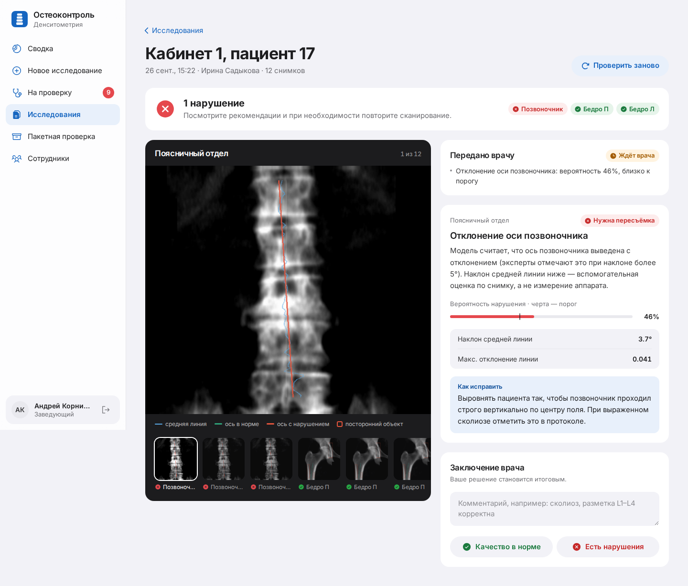

## Содержание

1. [Зачем это нужно](#зачем-это-нужно)
2. [Что умеет](#что-умеет)
3. [Роли и сценарии](#роли-и-сценарии)
4. [Быстрый старт](#быстрый-старт)
5. [Пакетная обработка](#пакетная-обработка)
6. [Форматы входных и выходных данных](#форматы-входных-и-выходных-данных)
7. [API](#api)
8. [Модель](#модель)
9. [Результаты](#результаты)
10. [Архитектура и структура проекта](#архитектура-и-структура-проекта)
11. [Системные требования и зависимости](#системные-требования-и-зависимости)
12. [Вход через Госуслуги (ЕСИА)](#вход-через-госуслуги-есиа)
13. [Тестовые данные](#тестовые-данные)
14. [Развёртывание на сервере](#развёртывание-на-сервере)
15. [Обучение модели](#обучение-модели)
16. [Известные ошибки и их обработка](#известные-ошибки-и-их-обработка)
17. [Ограничения и развитие](#ограничения-и-развитие)
18. [Разработка и тесты](#разработка-и-тесты)

## Зачем это нужно

Достоверность денситометрии зависит не только от аппарата, но и от укладки пациента, выбора области,
отсутствия артефактов и корректной разметки. Ошибка обнаруживается, когда пациент уже ушёл: исследование
приходится повторять, а это лишнее облучение, время и деньги. Сейчас контроль качества делает врач вручную,
и для этого нужно знать критерии для каждой анатомической области.

Остеоконтроль переносит проверку на момент сканирования:

- **лаборант** сразу видит нарушение и подсказку, как его исправить;
- **врач** получает только сомнительные случаи, а не весь поток;
- **заведующий** видит качество отделения в цифрах и понимает, кого обучить.

## Что умеет

| Функция | Где |
|---|---|
| Приём DICOM-исследования (1–40 снимков), определение области каждого снимка: поясничный отдел, правое или левое бедро | веб, API |
| Бинарная оценка «качественное / есть нарушение» для каждой области и исследования в целом | веб, API, пакет |
| Типы нарушений (мультиметка: у исследования может быть несколько нарушений одновременно) | веб, API, пакет |
| Объяснение: вероятность относительно порога, измеренные признаки (угол оси, число посторонних объектов), текст «как исправить» | веб |
| Визуализация на снимке: средняя линия, ось позвоночника или диафиза, рамки вокруг посторонних объектов | веб, PNG, DICOM-серия |
| Очередь врача: система сама отправляет на проверку случаи, где вероятность близко к порогу или область определена неуверенно | веб |
| Заключение врача (подтвердил / исправил), статистика согласия врача с системой | веб |
| Сводка для заведующего: доля качественных исследований, разбор врачом, частые нарушения, лаборанты, которым нужен разбор укладки, точность модели | веб |
| Пакетная обработка архива: `results.csv` / `results.xlsx` в формате ТЗ и дополнительная DICOM-серия с визуализацией | веб, API, скрипт |
| Вход по паролю и через Госуслуги (ЕСИА, тестовый контур), роли, блокировка сотрудников | веб |
| Обезличивание: производитель, модель и серийный номер аппарата, учреждение и данные пациента не читаются и не хранятся; исходные имена файлов заменяются | везде |

### Таксономия нарушений

Классы взяты из экспертной разметки организаторов и совпадают с критериями ТЗ (раздел 2.3):

| Код | Область | Критерий ТЗ | Серьёзность |
|---|---|---|---|
| `SPINE_POSITIONING` | поясничный отдел | корректная укладка: видны верхние края подвздошных костей и половина Th12 | пересъёмка |
| `SPINE_AXIS` | поясничный отдел | ось позвоночника выровнена, наклон не больше 5° | пересъёмка |
| `SPINE_ARTIFACT` | поясничный отдел | нет посторонних предметов, выраженных артефактов, наложений | пересъёмка |
| `HIP_ROTATION` | правое / левое бедро | правильное позиционирование, нет ротации (оценка по малому вертелу) | пересъёмка |
| `HIP_ROI` | правое / левое бедро | корректная область интересов: 3 см сверху и снизу, 2 см сбоку | пересъёмка |
| `SPINE_OTHER`, `HIP_OTHER` | — | общая модель области считает её некачественной, но ни одна частная модель не уверена в конкретном типе | проверка врачом |

Если нарушений несколько, возвращаются все: каждое проверяется своей моделью, а итог по области
«некачественная», если сработала хотя бы одна. Исследование качественное, только если качественны все его области.

## Роли и сценарии

| Роль | Главный экран | Что может |
|---|---|---|
| **Лаборант** | «Новое исследование» | загружать исследования, видеть свои результаты и подсказки по пересъёмке |
| **Врач-рентгенолог** | «На проверку» | очередь сомнительных случаев, итоговое заключение, все исследования, пакетная проверка |
| **Заведующий** | «Сводка» | всё, что может врач, плюс статистика отделения и управление сотрудниками |

**Лаборант** загружает снимки и через несколько секунд видит вердикт. Если есть нарушение, на снимке
подсвечено, где именно, а в карточке написано, как исправить. Сомнительные случаи система сама отправляет врачу.

| Загрузка | Список исследований |
|---|---|
| 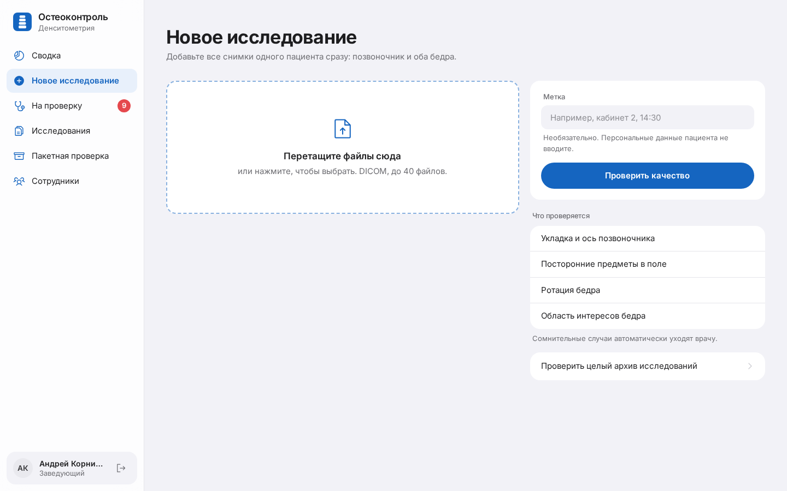 | 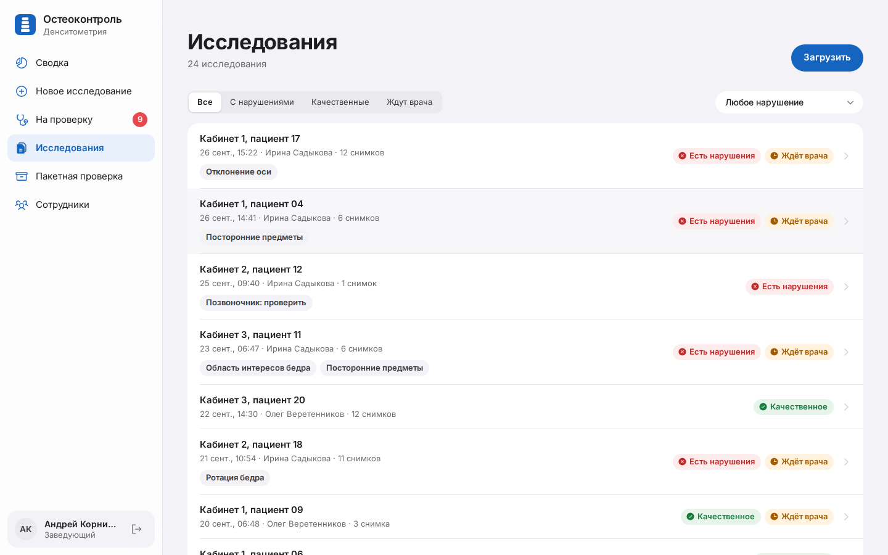 |

**Врач** работает с очередью. Его решение становится итоговым, а статистика согласия врача с системой
показывает, насколько модели можно доверять.

| Очередь на телефоне | Карточка на телефоне | Очередь на компьютере |
|---|---|---|
| 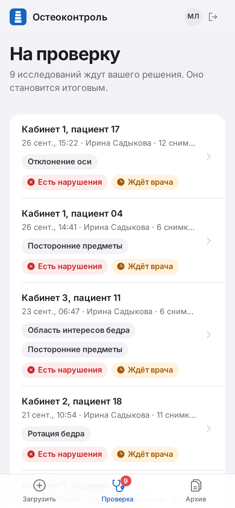 | 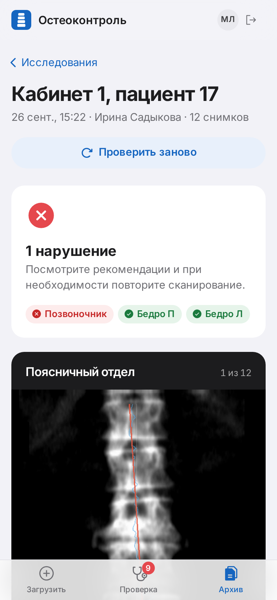 | 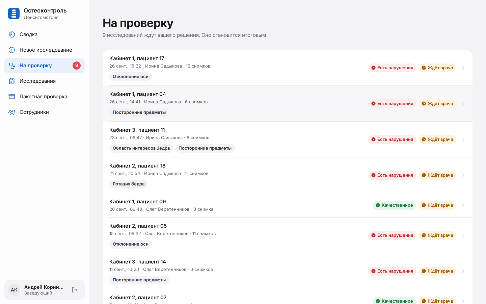 |

**Заведующий** видит качество отделения. Три кольца показывают долю качественных исследований, долю
разобранных врачом сомнительных случаев и согласие врача с системой. Ниже: динамика, частые нарушения,
лаборанты с высокой долей нарушений и точность модели.

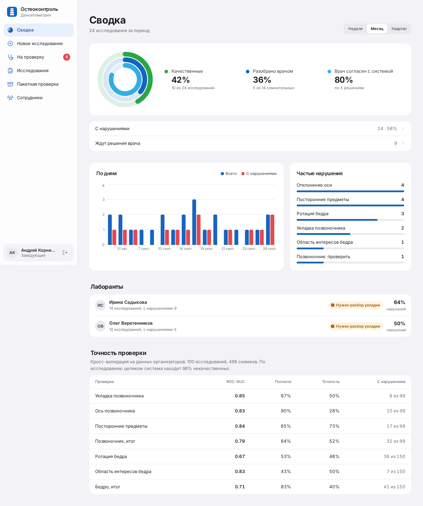

| Сотрудники | Пакетная проверка |
|---|---|
| 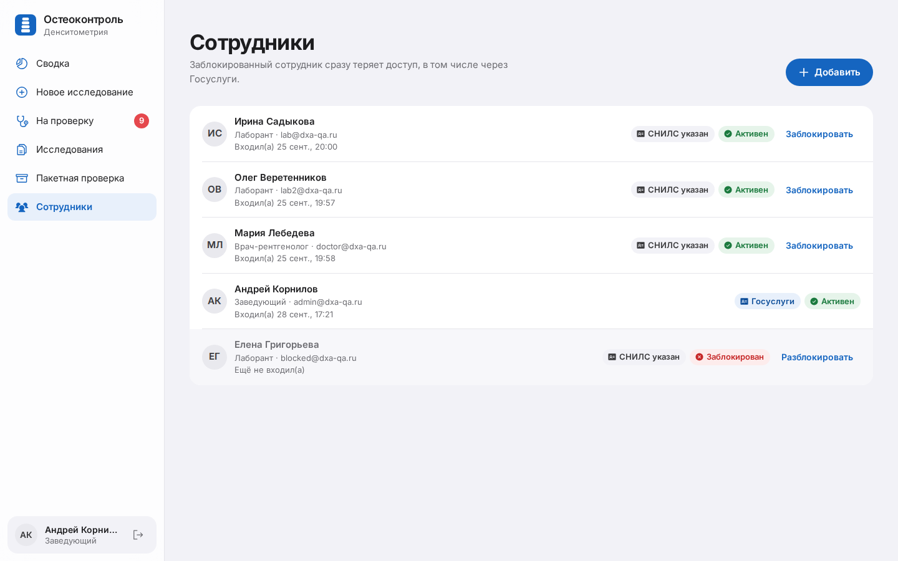 | 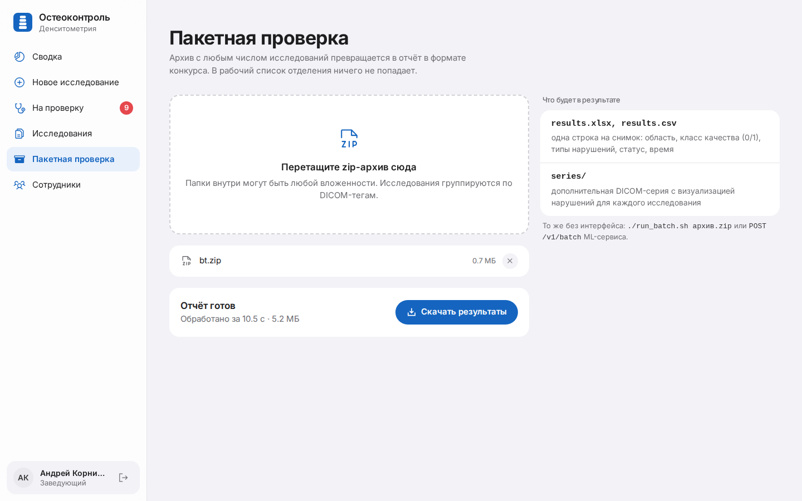 |

## Быстрый старт

Нужны Docker и Docker Compose v2 (Linux, macOS или Windows с WSL2).

```bash
git clone <адрес-репозитория> dxa-qa && cd dxa-qa
./run.sh
```

Скрипт создаст `.env` со случайным `JWT_SECRET`, соберёт образы и поднимет стек. После запуска:

| Адрес | Что там |
|---|---|
| http://localhost:3000 | веб-интерфейс |
| http://localhost:8000/docs | Swagger основного API (core) |
| http://localhost:8001/docs | Swagger ML-сервиса (анализ, пакетная обработка) |

Вход: `admin@dxa-qa.ru` / `admin12345` (заведующий), `doctor@dxa-qa.ru` / `doctor12345` (врач),
`lab@dxa-qa.ru` / `lab12345` (лаборант). Или кнопка «Войти через Госуслуги», пароль тестовых людей `esia12345`.

`./run.sh stop` останавливает стек, `./run.sh logs` показывает логи.

Если датасет организаторов распакован в `data/train/Исследования`, при первом запуске в базу загрузятся
24 демо-исследования, чтобы сводка и очередь не были пустыми.

## Пакетная обработка

Для проверки на закрытом наборе веб-интерфейс и база не нужны. Достаточно одной команды:

```bash
./run_batch.sh /путь/к/исследованиям            # папка с DICOM в любой вложенности
./run_batch.sh /путь/к/архиву.zip ./results      # или zip-архив
```

Скрипт собирает образ ML-сервиса и запускает его **без сети** (`--network none`), так что изображения
никуда не передаются. Результат в `./results`:

```
results/
  results.csv        одна строка на снимок, формат ТЗ
  results.xlsx       то же для Excel
  series.zip         дополнительные DICOM-серии с визуализацией
  series/study_0001/qa_1.dcm ...
  previews/study_0001/preview_0.png ...
```

Как это работает:

1. Все файлы проверяются на сигнатуру DICOM (`DICM`) или расширение `.dcm`; остальные пропускаются.
2. Снимки группируются в исследования по `StudyInstanceUID`, а если его нет — по родительской папке.
3. Каждое исследование анализируется целиком: признаки снимков одной области усредняются, как при обучении.
4. Ошибка на одном снимке или исследовании не останавливает обработку: строка получает
   `processing_status = Failure` и текст ошибки.

Без Docker: `cd services/ml && uv run python -m app.batch <вход> <выход>`.

Через HTTP: `curl -F archive=@studies.zip http://localhost:8001/v1/batch -o results.zip`.

## Форматы входных и выходных данных

**Вход.** DICOM-исследования денситометрии без разметки: одно или несколько изображений (в датасете
организаторов до 29). Поддерживаются MONOCHROME1 и MONOCHROME2, 8 и 16 бит, многокадровые файлы
(берётся первый кадр), файлы без стандартной преамбулы. Метаданные пациента и аппарата модели не нужны.

**Выход пакетной обработки** (`results.csv` / `results.xlsx`). Первые восемь колонок в точности соответствуют
разделу 2.5 ТЗ, остальные добавлены для удобства:

| Колонка | Описание | Тип |
|---|---|---|
| `path_to_study` | путь к файлу относительно входной папки или архива | String |
| `study_uid` | `StudyInstanceUID` из DICOM | String |
| `image_uid` | `SOPInstanceUID` из DICOM | String |
| `anatomical_region` | `spine`, `right_hip`, `left_hip` или `unknown` | String |
| `quality_class` | 0 — качественное, 1 — есть нарушение (для области этого снимка) | Integer |
| `violation_type` | коды нарушений области через `;`, например `SPINE_AXIS;SPINE_ARTIFACT` | String |
| `processing_status` | `Success` / `Failure` | String |
| `time_of_processing` | время обработки в секундах (время исследования, поделённое на число снимков) | Float |
| `study_quality_class` | итог по исследованию целиком: 0 / 1 | Integer |
| `violation_probability` | вероятность нарушения области по общей модели | Float |
| `needs_review` | система рекомендует проверку врачом | Boolean |
| `additional_series` | путь к DICOM Secondary Capture с визуализацией | String |
| `error` | причина `Failure` или пометка «Область не определена» | String |

Пример строки:

```csv
path_to_study,study_uid,image_uid,anatomical_region,quality_class,violation_type,processing_status,time_of_processing,...
study_07/CR000002.dcm,1.2.840...,1.2.840...,left_hip,1,HIP_ROTATION,Success,0.299,...
```

**Дополнительная серия.** Для каждого снимка создаётся DICOM Secondary Capture (RGB) с тем же
`StudyInstanceUID` и новой серией «DXA-QA: визуализация контроля качества». Она открывается в любом
DICOM-просмотрщике рядом с исходным исследованием.

## API

Полная интерактивная документация — в Swagger (`/docs`) каждого сервиса.

### ML-сервис (порт 8001, без авторизации, только внутренняя сеть)

| Метод | Путь | Что делает |
|---|---|---|
| `GET` | `/health` | жив ли сервис, загружена ли модель |
| `GET` | `/v1/model` | версия модели и метрики кросс-валидации |
| `POST` | `/v1/analyze` | анализ одного исследования: `{"study_id": "...", "files": ["studies/<id>/0.dcm", ...]}` → вердикт, области, нарушения, превью |
| `POST` | `/v1/batch` | пакетная обработка: `multipart/form-data`, поле `archive` (zip) → zip с `results.csv`, `results.xlsx`, `series/`, `previews/` |

Контракт ответа `/v1/analyze` описан в `services/ml/app/schemas.py`:

```json
{
  "study_id": "…",
  "quality_ok": false,
  "needs_review": true,
  "review_reasons": ["Отклонение оси позвоночника: вероятность 46%, близко к порогу"],
  "regions": [{"region": "spine", "quality_ok": false, "probability_bad": 0.27, "threshold": 0.31, "image_indexes": [0]}],
  "violations": [{
    "code": "SPINE_AXIS", "region": "spine", "severity": "critical",
    "probability": 0.46, "threshold": 0.41,
    "title_ru": "Отклонение оси позвоночника", "message_ru": "…", "how_to_fix_ru": "…",
    "evidence": {"axis_angle_deg": 3.7, "axis_max_deviation": 0.041}, "image_indexes": [0]
  }],
  "images": [{"index": 0, "file": "…", "region": "spine", "region_confidence": 0.99, "preview_path": "…png"}],
  "metadata": {"modality": "CR"},
  "model_version": "1.0",
  "processing_ms": 1580
}
```

### Основное API (порт 8000, префикс `/api/v1`, JWT Bearer)

| Метод | Путь | Роли | Что делает |
|---|---|---|---|
| `POST` | `/auth/login` | все | вход по email и паролю (форма OAuth2) → JWT |
| `GET` | `/auth/me` | все | текущий пользователь |
| `GET` | `/auth/esia/config` | все | включён ли вход через Госуслуги и в каком режиме |
| `GET` | `/auth/esia/start?redirect_uri=` | все | URL авторизации ЕСИА и подписанный `state` |
| `POST` | `/auth/esia/callback` | все | обмен кода ЕСИА на JWT |
| `POST` | `/studies` | все | загрузка исследования (DICOM-файлы) → 202, анализ идёт в фоне |
| `GET` | `/studies` | все | список: фильтры `quality_ok`, `review_status`, `code`; лаборант видит только свои |
| `GET` | `/studies/queue` | врач, заведующий | очередь сомнительных случаев |
| `GET` | `/studies/{id}` | все | карточка исследования с результатом |
| `GET` | `/studies/{id}/images/{index}` | все | PNG-превью с визуализацией |
| `POST` | `/studies/{id}/review` | врач, заведующий | заключение врача |
| `POST` | `/studies/{id}/reanalyze` | все | повторная проверка |
| `POST` | `/studies/batch` | врач, заведующий | пакетная проверка zip (проксируется в ML) |
| `GET` | `/stats/summary?days=` | заведующий | сводка отделения |
| `GET/POST/PATCH` | `/users` | заведующий | сотрудники: создание, роль, СНИЛС, блокировка |
| `GET` | `/system/status` | все | состояние БД и ML-сервиса |

## Модель

### Подход и почему он такой

Данных мало: 100 исследований, 499 снимков, от 6 до 36 примеров на нарушение. Нейросеть на таком объёме
переобучится, а врачу нужно не только «плохо», но и «почему». Поэтому решение построено как
**«измеряем то, на что смотрит врач, и учим классификатор на этих измерениях»**:

1. **Предобработка.** DICOM → 2D-массив uint8: учёт MONOCHROME1 (инверсия), нормализация 16-битных
   данных по мин/макс, первый кадр многокадровых файлов. Левое бедро зеркалится, поэтому данные обеих
   сторон объединяются в одну выборку.
2. **Определение области** (позвоночник / правое / левое бедро). HOG-дескриптор + логистическая регрессия.
   Разметки по снимкам нет, поэтому классы получены без учителя: KMeans на 3 кластера по HOG, кластеры
   названы по асимметрии кадра. Проверка — на подписанных файлах организаторов.
3. **Признаки качества** — измеримые величины, соответствующие критериям ТЗ:
   - ось позвоночника: угол и максимальное отклонение средней линии тел позвонков (критерий «до 5°»);
   - укладка: смещение позвоночника от центра, асимметрия левой и правой половин кадра;
   - посторонние предметы: тонкие яркие линии вне кости (white top-hat — провода, косточки белья) и яркие включения;
   - ротация бедра: угол диафиза и профиль яркости в зоне малого вертела;
   - область интересов: ширина диафиза относительно кадра, площадь закрытой маской зоны.
4. **Классификаторы.** Для каждого нарушения и итога по области перебираются логистическая регрессия
   (L1, L2, на геометрических и ключевых признаках), Random Forest и Extra Trees. Лучшая модель выбирается
   по ROC-AUC на кросс-валидации.
5. **Постобработка.**
   - Порог каждой модели подобран по F1 на out-of-fold предсказаниях.
   - Затем общий множитель порогов подобран по сбалансированной точности итога по исследованию:
     система настроена «лучше перепроверить, чем пропустить».
   - Если вероятность ближе 0.12 к порогу или уверенность в области ниже 80%, исследование уходит врачу.
   - Если общая модель области считает её плохой, а частные модели не уверены, возвращается `*_OTHER`.

### Разбиение выборки и защита от утечки

Кросс-валидация **StratifiedGroupKFold по исследованиям**: снимки одного пациента никогда не оказываются
одновременно в обучении и проверке. 5 повторов с разными разбиениями, вероятности усредняются.
Доверительные интервалы 95% посчитаны **кластерным бутстрапом** (1000 выборок, пересэмплируются целые
исследования).

Дисбаланс классов (нарушений от 5% до 32%) учтён через `class_weight="balanced"` в моделях и подбор порога
по F1, а не по accuracy.

## Результаты

Кросс-валидация по исследованиям (StratifiedGroupKFold, 5 повторов) на датасете организаторов: 100 исследований, 499 снимков. В скобках — 95% доверительный интервал (кластерный бутстрап по исследованиям, 1000 выборок).

**Итог по исследованию «качественное / есть нарушение»** (главная клиническая метрика, 100 исследований, из них 50 с нарушениями):

| Чувствительность | Специфичность | Сбалансированная точность | F1 |
|---|---|---|---|
| **0.96** [0.90–1.00] | 0.40 [0.27–0.54] | 0.68 [0.60–0.75] | 0.75 [0.67–0.83] |

Система находит 96% некачественных исследований. Это сознательный выбор: пропущенное нарушение
означает повторный визит пациента, а лишняя проверка стоит врачу минуту. Сомнительные случаи уходят в очередь.

**По типам нарушений и областям:**

| Проверка | ROC-AUC [95% ДИ] | F1 [95% ДИ] | Чувствительность [95% ДИ] | Специфичность [95% ДИ] | С нарушением | Модель |
|---|---|---|---|---|---|---|
| Укладка позвоночника | 0.85 [0.60–0.99] | 0.57 [0.20–0.86] | 0.67 [0.25–1.00] | 0.96 [0.91–0.99] | 6 из 99 | `logreg_geom` |
| Ось позвоночника | 0.83 [0.73–0.92] | 0.43 [0.23–0.61] | 0.90 [0.67–1.00] | 0.74 [0.65–0.83] | 10 из 99 | `logreg_l1` |
| Посторонние предметы | 0.84 [0.70–0.96] | 0.69 [0.46–0.85] | 0.65 [0.41–0.88] | 0.95 [0.90–0.99] | 17 из 99 | `extra_trees` |
| Позвоночник, итог | 0.79 [0.68–0.88] | 0.64 [0.51–0.75] | 0.84 [0.71–0.96] | 0.63 [0.51–0.75] | 32 из 99 | `rf_key` |
| Ротация бедра | 0.67 [0.56–0.77] | 0.49 [0.33–0.63] | 0.53 [0.35–0.69] | 0.81 [0.71–0.89] | 36 из 150 | `random_forest` |
| Область интересов бедра | 0.83 [0.63–0.97] | 0.46 [0.00–0.80] | 0.43 [0.00–0.86] | 0.98 [0.94–1.00] | 7 из 150 | `logreg_l1` |
| Бедро, итог | 0.71 [0.61–0.80] | 0.54 [0.41–0.65] | 0.83 [0.71–0.93] | 0.53 [0.42–0.64] | 41 из 150 | `random_forest` |

macro-F1 по пяти типам нарушений: **0.53**.

- **Определение области снимка:** все 3 подписанных файла организаторов (ПОП, ППОБ, ЛПОБ) определены верно;
  499 снимков датасета разделились почти поровну: 166 позвоночник, 164 правое и 169 левое бедро.
- **Сравнение с прозрачным правилом:** один только угол оси как оценка даёт ROC-AUC 0.86
  для нарушения оси, то есть признаки действительно отражают клинический критерий «наклон до 5°».
- **Сравнение моделей:** для каждой проверки перебиралось 8 моделей, ROC-AUC всех кандидатов сохранены в
  `services/ml/models/metrics.json` (`candidates_auc`).

Скорость: в среднем **1.9 с на исследование** (0.33 с на снимок), максимум 8.9 с на исследовании из 29 снимков.
Замер на одном ядре Intel Xeon 2.1 ГГц, без GPU, включая отрисовку визуализаций. Требование ТЗ — не более 3 минут.

## Архитектура и структура проекта

```
Браузер ─► frontend (React, nginx :3000) ── /api ─► core (FastAPI :8000) ─► PostgreSQL
                                                        │ HTTP
                                                        ▼
                                                   ml (FastAPI :8001)  ◄── run_batch.sh / POST /v1/batch
             общий том /data: DICOM и визуализации (файлы не гоняются по HTTP)
```

- **core** — сотрудники и роли (JWT, argon2), вход через ЕСИА, загрузка исследований, фоновый вызов ML,
  заключения врача, статистика. Async SQLAlchemy 2.0 + Alembic.
- **ml** — без БД и пользователей: получил пути к DICOM или архив — вернул вердикт. Модель загружается один
  раз при старте, анализ выполняется в пуле потоков, чтобы не блокировать сервис.
- **frontend** — React 19, Vite, Tailwind 4, TanStack Query. Интерфейс в стиле приложений Apple:
  системный шрифт, сайдбар на компьютере и таб-бар на телефоне.

```
.
├── run.sh                    сборка и запуск всего стека
├── run_batch.sh              пакетная обработка в контейнере без сети
├── docker-compose.yml        стек для локального запуска
├── docker-compose.prod.yml   стек для сервера (наружу только HTTPS)
├── Caddyfile                 HTTPS-прокси для сервера
├── .env.example              все настройки с комментариями
├── docs/screenshots/         скриншоты для этого README
├── frontend/src/
│   ├── pages/                Login, Upload, Studies, StudyDetail, Queue, Dashboard, Users, Batch, Esia*
│   ├── components/           Layout (навигация), ui (единые статусы, списки)
│   └── auth/                 сессия, вход через ЕСИА
└── services/
    ├── core/
    │   ├── app/auth/         сотрудники, роли, JWT, esia/ (провайдеры mock и real, проверка СНИЛС)
    │   ├── app/studies/      загрузка, анализ в фоне, заключение врача, пакетная проверка
    │   ├── app/stats/        сводка заведующего
    │   ├── app/scripts/      seed (сотрудники), seed_demo (демо-исследования)
    │   ├── migrations/       Alembic
    │   └── tests/            API, ЕСИА, безопасность
    └── ml/
        ├── app/schemas.py    контракт ML-сервиса
        ├── app/pipeline/     dicom_io, features, analyzer, overlay
        ├── app/batch.py      пакетная обработка → csv/xlsx + DICOM-серии
        ├── scripts/train.py  обучение и метрики с доверительными интервалами
        ├── models/           обученная модель (dxa_quality.joblib) и metrics.json
        ├── reference/        справочник нарушений и тексты «как исправить»
        └── tests/            инференс, пакетная обработка
```

## Системные требования и зависимости

GPU не нужен: модели классические, инференс идёт на CPU.

| | Минимум | Рекомендуется |
|---|---|---|
| **Только пакетная обработка** (`run_batch.sh`) | 1 vCPU, 1 ГБ RAM, 2 ГБ диска | 2 vCPU, 2 ГБ RAM |
| **Вся платформа** (`run.sh`) | 1 vCPU, 2 ГБ RAM, 4 ГБ диска | 2 vCPU, 4 ГБ RAM, 10 ГБ диска |

Память в работе: ML-сервис с загруженной моделью ≈ 215 МБ, core ≈ 90 МБ, PostgreSQL ≈ 50 МБ.
На целевой конфигурации организаторов (44 CPU, 256 ГБ RAM) пакетную обработку можно распараллелить
по исследованиям.

Все зависимости зафиксированы: Python — в `uv.lock` каждого сервиса, фронтенд — в `package-lock.json`,
базовые образы — по тегам в Dockerfile.

| Компонент | Версии |
|---|---|
| Базовые образы | `python:3.12-slim`, `ghcr.io/astral-sh/uv:0.8`, `postgres:16-alpine`, `node:22-alpine`, `nginx:1.27-alpine`, `caddy:2-alpine` |
| ML | scikit-learn 1.9.1, scikit-image 0.26.0, numpy 2.4.6, pandas 3.0.6, pydicom 3.0.2, pillow 12.3.0, openpyxl 3.1.5 |
| API | FastAPI 0.141.1, pydantic 2.13.5, uvicorn 0.54.0, httpx 0.28.1 |
| core | SQLAlchemy 2.1.1, asyncpg 0.31.0, Alembic 1.20.0, PyJWT 2.15.0, pwdlib (argon2) 0.3.1 |
| frontend | React 19.3.0, Vite 7.3.6, Tailwind CSS 4.3.3, TanStack Query 5.103.2, React Router 7.18.4, Recharts 3.10.1, TypeScript 5.9.3 |

## Вход через Госуслуги (ЕСИА)

Сотрудник входит через Госуслуги, система находит его по СНИЛС. Незарегистрированный человек или
заблокированный сотрудник получает понятный отказ.

| Экран входа | Тестовый контур ЕСИА |
|---|---|
| 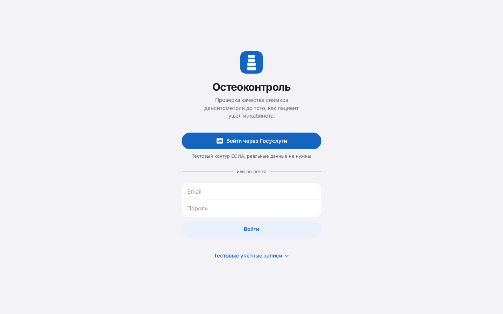 | 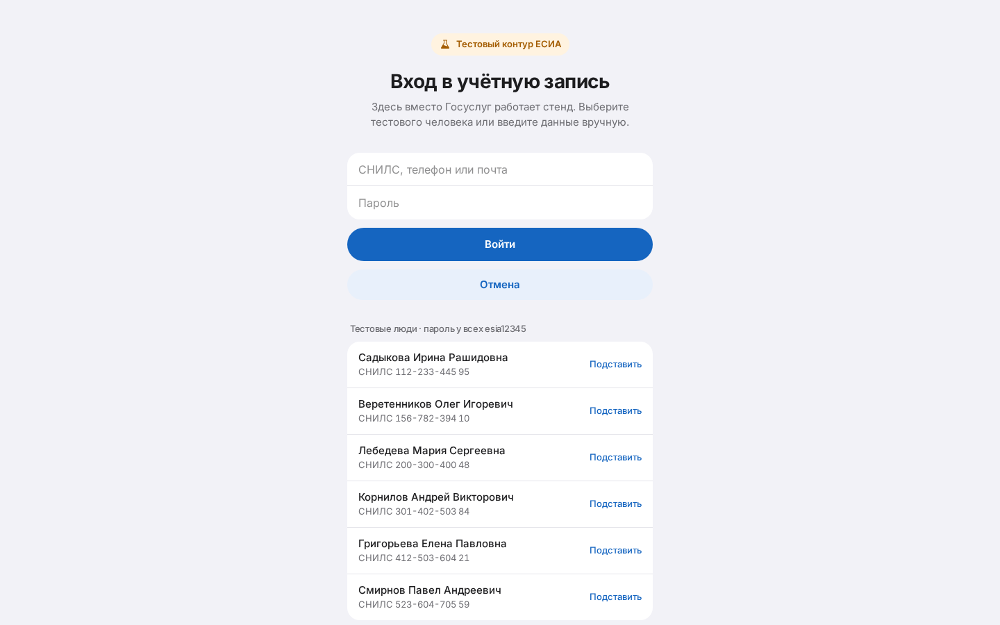 |

Поток OAuth 2.0 (authorization code):

1. `GET /auth/esia/start` возвращает URL авторизации и `state`. `state` — подписанный JWT на 10 минут,
   на сервере он не хранится.
2. Пользователь входит на ЕСИА, та возвращает браузер на `/auth/esia/callback?code=…&state=…`.
3. Фронтенд сверяет `state` с сохранённым в `sessionStorage` (защита от CSRF) и отдаёт код в
   `POST /auth/esia/callback`.
4. Core меняет код на данные человека (oid, СНИЛС, ФИО). Сотрудник ищется по oid, при первом входе — по
   СНИЛС, после чего oid запоминается.

Адрес возврата разрешён только на свой фронтенд (`CORS_ORIGINS` + `/auth/esia/callback`), поэтому код
нельзя увести на чужой сайт. СНИЛС проверяется по контрольному числу.

Режим задаётся `ESIA_MODE`:

- `mock` (по умолчанию) — тестовый контур внутри приложения, данные тестовых людей ниже;
- `real` — настоящая ЕСИА. Нужны регистрация информационной системы, сертификат ГОСТ Р 34.10-2012 и сервис
  подписи с КриптоПро (`ESIA_CLIENT_ID`, `ESIA_CERT_HASH`, `ESIA_SIGNER_URL`). Клиент —
  `services/core/app/auth/esia/provider.py`, `RealEsiaProvider`. Перед подключением сверьте параметры с
  действующими методическими рекомендациями ЕСИА;
- `off` — вход только по паролю.

## Тестовые данные

Все данные вымышленные. СНИЛС сгенерированы с правильным контрольным числом, но реальным людям не принадлежат.

**Вход по почте:**

| Роль | Email | Пароль |
|---|---|---|
| Лаборант | `lab@dxa-qa.ru` | `lab12345` |
| Лаборант | `lab2@dxa-qa.ru` | `lab12345` |
| Врач-рентгенолог | `doctor@dxa-qa.ru` | `doctor12345` |
| Заведующий | `admin@dxa-qa.ru` | `admin12345` |
| Заблокирован | `blocked@dxa-qa.ru` | `blocked12345` |

**Вход через тестовый контур ЕСИА** (логин — СНИЛС, телефон или почта; пароль у всех `esia12345`):

| Человек | СНИЛС | Результат |
|---|---|---|
| Садыкова Ирина Рашидовна | 112-233-445 95 | лаборант |
| Веретенников Олег Игоревич | 156-782-394 10 | лаборант |
| Лебедева Мария Сергеевна | 200-300-400 48 | врач |
| Корнилов Андрей Викторович | 301-402-503 84 | заведующий |
| Григорьева Елена Павловна | 412-503-604 21 | отказ: учётная запись заблокирована |
| Смирнов Павел Андреевич | 523-604-705 59 | отказ: не сотрудник (добавьте его в «Сотрудники» с этим СНИЛС — и вход заработает) |

**Демо-исследования:** `uv run python -m app.scripts.seed_demo` в `services/core` загружает 24 исследования
из датасета, раскидывает их на 30 дней между двумя лаборантами и прогоняет через настоящую модель; часть уже
разобрана врачом. Флаги: `--src <папка>`, `--limit N`, `--if-empty`.

## Развёртывание на сервере

`docker-compose.prod.yml`: база, ML и core наружу не открыты, фронтенд слушает только `127.0.0.1:3000`.

```bash
# на сервере с Docker
cp .env.example .env
nano .env   # POSTGRES_PASSWORD, JWT_SECRET (openssl rand -base64 48), DOMAIN=dxa.example.ru

# вариант А: чистый сервер — свой Caddy на 80/443 сам выпустит HTTPS-сертификат
docker compose -f docker-compose.prod.yml --profile caddy up -d --build

# вариант Б: на сервере уже есть веб-сервер — запустить без Caddy
docker compose -f docker-compose.prod.yml up -d --build
# и проксировать DOMAIN -> 127.0.0.1:3000
```

`DOMAIN` должен совпадать с адресом в браузере, иначе вход через Госуслуги отклонит адрес возврата.
Порты 5432, 8000 и 8001 наружу не открываются. Если Docker Hub недоступен, в `/etc/docker/daemon.json`
можно добавить зеркало `{"registry-mirrors": ["https://mirror.gcr.io"]}`.

## Обучение модели

Датасет организаторов распаковать так: `data/train/Исследования/…` и `data/train/разметка.xlsx`,
подписанные тестовые снимки — в `data/test`.

```bash
cd services/ml
uv sync
uv run python -m scripts.train --data ../../data/train --test ../../data/test
```

Что делает скрипт:

1. Находит все DICOM, строит классификатор области и проверяет его на подписанных снимках.
2. Для каждой пары «исследование — область» усредняет признаки снимков.
3. Для каждого нарушения перебирает модели на кросс-валидации по исследованиям (5 повторов), выбирает
   лучшую по ROC-AUC, подбирает порог по F1 и считает 95% доверительные интервалы.
4. Подбирает общий множитель порогов по сбалансированной точности итога по исследованию.
5. Сохраняет `models/dxa_quality.joblib` и `models/metrics.json`. Обучение воспроизводимо: сиды
   зафиксированы, на CPU занимает 15–30 минут.

Дообучение на новых данных: добавить исследования в `Исследования/` и строки в `разметка.xlsx` (формат
листа «Калибровка»), перезапустить скрипт. Тексты рекомендаций редактируются в
`services/ml/reference/violations.yml` без переобучения.

## Известные ошибки и их обработка

| Ситуация | Что происходит |
|---|---|
| Файл не DICOM (нет сигнатуры `DICM`, другое расширение) | при пакетной обработке пропускается; при загрузке через интерфейс — ошибка 422 с именем файла |
| Файл повреждён, пиксели не читаются | строка `Failure` с текстом «Не удалось прочитать изображение», остальные снимки обрабатываются |
| Область снимка не распознана или распознана неуверенно (< 80%) | `anatomical_region = unknown` или пометка для врача; исследование уходит в очередь проверки |
| В исследовании нет ни позвоночника, ни бедра | исследование помечается некачественным и отправляется врачу |
| Вероятность близко к порогу (±0.12) | вердикт выдаётся, но исследование попадает в очередь врача с причиной |
| Нестандартные значения DICOM-тегов (неверный VR, кодировка) | предупреждения pydicom подавляются, файл читается в режиме `force` |
| Архив опасен (путь `../`) или больше 5 ГБ после распаковки | отказ 400 до распаковки |
| Кириллица в именах файлов из zip, созданного в Windows | имена перекодируются из cp866 |
| ML-сервис недоступен | исследование получает статус «Ошибка», в интерфейсе показывается баннер; после восстановления — «Проверить заново» |
| База данных недоступна | `/health/db` отвечает 503, в интерфейсе баннер |
| Неверный пароль или истёкший токен | 401, интерфейс возвращает на экран входа; время ответа не выдаёт, существует ли email |
| ЕСИА: подделанный или истёкший `state`, чужой адрес возврата | 400 с понятным текстом, вход не выполняется |

## Ограничения и развитие

Ограничения:

- **Мало данных.** От 6 до 36 примеров на нарушение, поэтому доверительные интервалы широкие. Честную оценку
  даст закрытый набор организаторов.
- **Ротация бедра — самая трудная проверка** (ROC-AUC 0.67): признак — видимость малого вертела, а он часто
  закрыт маской аппарата.
- **Модель выбиралась на той же кросс-валидации**, поэтому цифры слегка оптимистичны.
- **Классификатор области обучен без учителя** и проверен на трёх подписанных снимках. На снимках других
  аппаратов его надо перепроверить.
- **Автоматической коррекции разметки нет:** система показывает, что не так, но не переставляет ROI сама.
- **Вход через Госуслуги работает в тестовом контуре.** Для боевой ЕСИА нужна регистрация системы.

Развитие:

1. Пилот в одном отделении: собрать заключения врача через очередь и дообучить модели на них.
2. Сегментация тел позвонков и точная оценка оси и области интересов по ключевым точкам.
3. Текстовый отчёт в формате DICOM SR и отправка в PACS.
4. Подключение к боевой ЕСИА и интеграция с медицинской информационной системой.

## Разработка и тесты

Нужны [uv](https://docs.astral.sh/uv/), Node 20+ и Docker для PostgreSQL.

```bash
docker compose up -d db

# ML (терминал 1)
cd services/ml && uv sync && uv run uvicorn app.main:app --port 8001 --reload

# core (терминал 2)
cd services/core && uv sync
uv run alembic upgrade head
uv run python -m app.scripts.seed
uv run python -m app.scripts.seed_demo     # демо-исследования, нужен запущенный ML
uv run uvicorn app.main:app --port 8000 --reload

# frontend (терминал 3) — http://localhost:5173, /api проксируется в core
cd frontend && npm install && npm run dev
```

Тесты и проверки:

```bash
cd services/core && uv run pytest && uv run ruff check .   # нужен Postgres и база dxa_test
cd services/ml && uv run pytest && uv run ruff check .     # нужен data/test
cd frontend && npm run build
```

- core: 15 тестов — роли, загрузка, полный цикл исследования, отказ ML, вход через ЕСИА, пакетная проверка.
- ml: 4 теста — определение областей на подписанных снимках, формат отчёта по ТЗ, устойчивость к битым
  файлам, защита от zip-slip, HTTP API.
